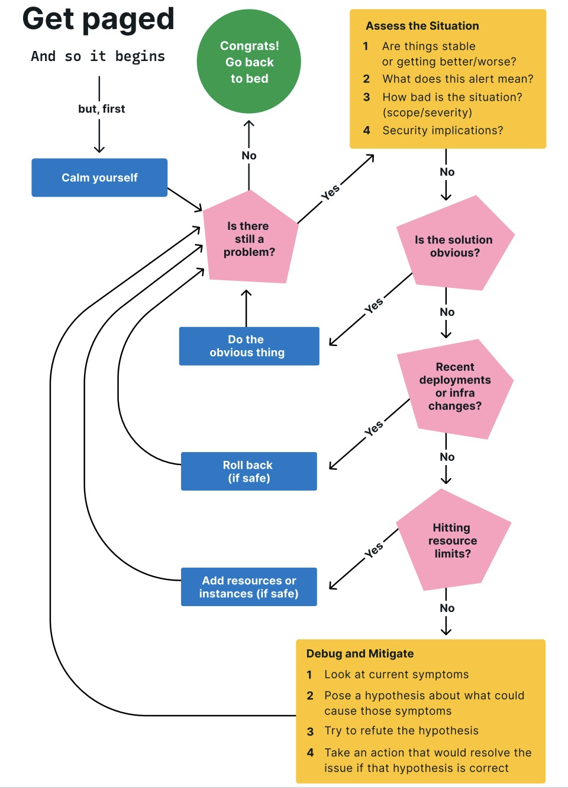

# Metadata
Author：Lindsay Tyson, Software Engineer at Lightstep  
Title: Incident management handbook  
Organizaiton: Lightstep  
Stars: 3 stars  

# Goal
Lindsay is passionate about using distributed tracing
to level the playing field and make the
debugging process more accessible to all
engineers, not just system experts.

# Flow

# On call duty
the on-call engineer typically only has one goal: to mitigate the impact on users (and revenue) as quickly as possible.
Finding the root cause is nice but not essential.

# What is missing in the article
Service depedency is essential in micro-services environments. The service that should be rolled back probably is not the service that shows symptoms.